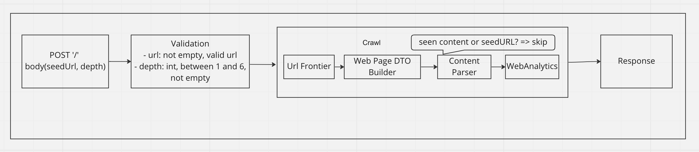
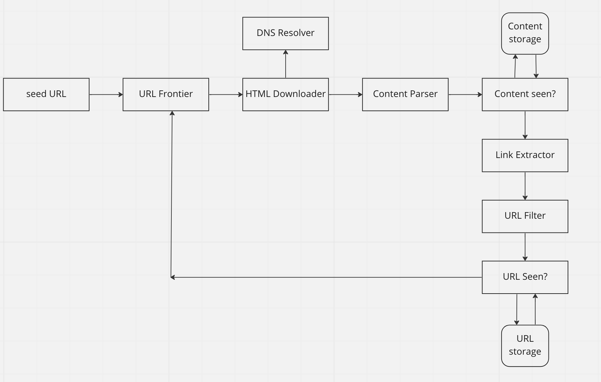

# Web Crawler

### *Requirements:*

- Using PHP, build a web crawler to display information about a given website.
Crawl 4-6 pages of our website agencyanalytics.com given a single entry point. Once
the crawl is complete, display the following results:
   - Number of pages crawled
   - Number of a unique images
   - Number of unique internal links
   - Number of unique external links
   - Average page load in seconds
   - Average word count
   - Average title length
- Also display a table that shows each page you crawled and the HTTP status code.

### *Development process:*

I found myself thinking that a Web crawler could become a more complex system if we want to cover different topics 
like scalability, resilience, availability, and so on. However, taking in mind a restricted time for the 
implementation and current requirements, I tend toward to think about a quite simple architecture, which on the one hand, 
will still be open for modification or extension, on the other hand, will take not a lot of time to 
implement and cover the requirements.

Based on the challenge description, I decided to use a Laravel framework.
I set up the project locally via docker; Laravel provides for this a very straightforward 'sail' util.

The following diagram describes a current system design:

More complex abstract web crawler system design might look like this:

#### Tests:

I added a base tests coverage. Because I am limited in time more tests should be written to cover 
fully web crawler parser logic. 

- To run tests: 

       php artisan test

## Local environment:

_Set up project locally via docker:_ 

 - install docker
 - run command

       composer install
- run command

       vendor/bin/sail up -d

The app should be accessible at _http://localhost/_.

## Production environment:

 - project deployed and configured on AWS EC-2 instance
 - nothing to do, just go to => _http://web-crawler.mariia-vain.com/_.

## Thank you for the challenge!
